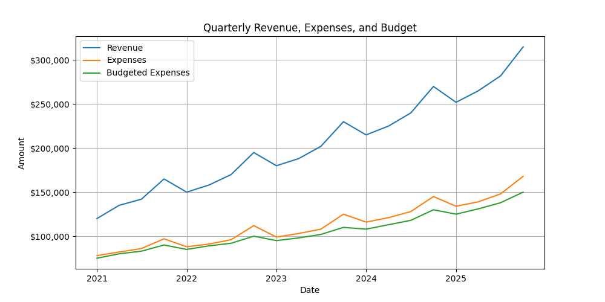
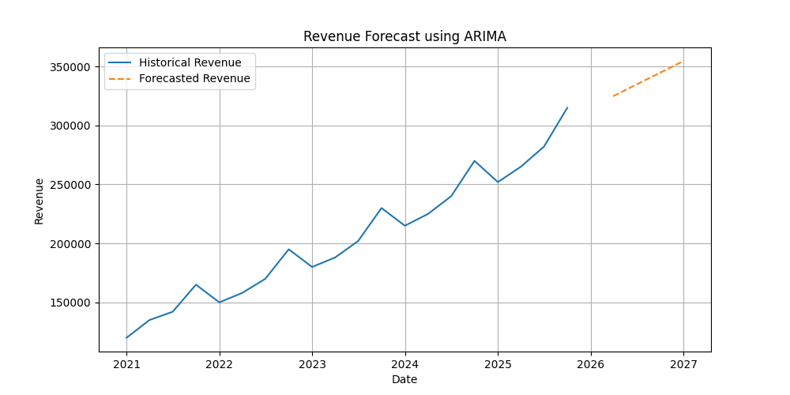
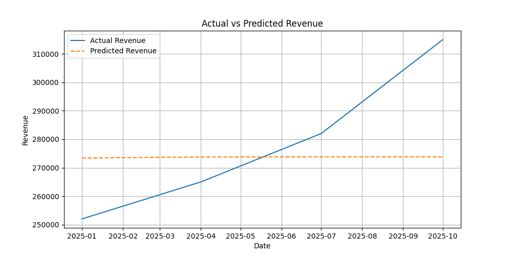
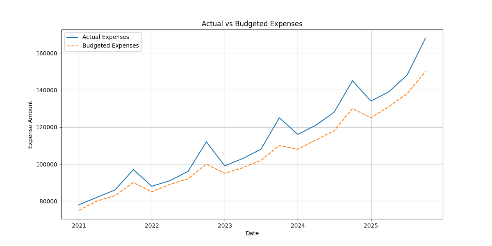
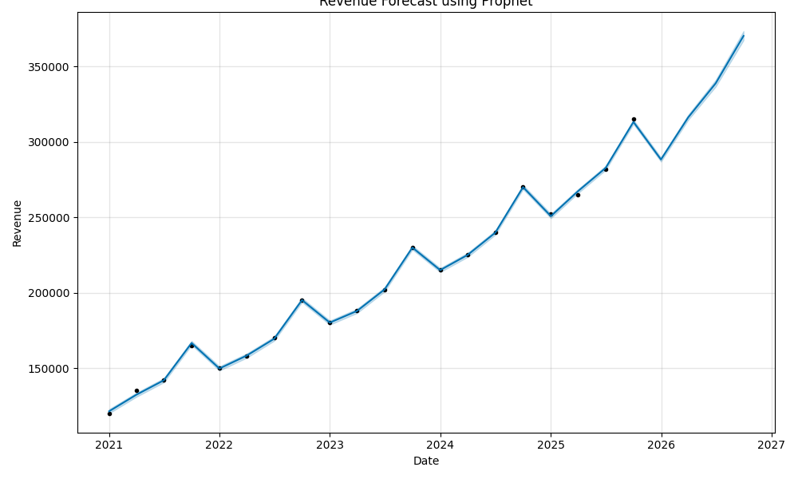

# Financial Forecasting and Budget Variance Analysis

This project uses Python-based time-series forecasting to predict quarterly revenue and analyze budget variance. It combines ARIMA and Prophet forecasting models with automated variance alerts to identify cost overruns and support proactive financial planning.

## Tools Used

- Python
- pandas
- NumPy
- matplotlib
- statsmodels
- Prophet
- scikit-learn
- Jupyter Notebook

## Project Features

- Loaded and cleaned quarterly financial data
- Visualized revenue, expenses, and budget trends
- Built ARIMA model for revenue forecasting
- Built Prophet model for trend and seasonality forecasting
- Evaluated forecast accuracy using MAPE
- Calculated actual vs. budget variance
- Flagged budget overruns above 10%
- Exported forecast and variance reports as CSV files

## Project Visualizations

### Revenue trends

### ARIMA Revenue Forecast

### Actual vs Predicted Revenue

### Budget Variance Analysis

### Prophet Forecast

